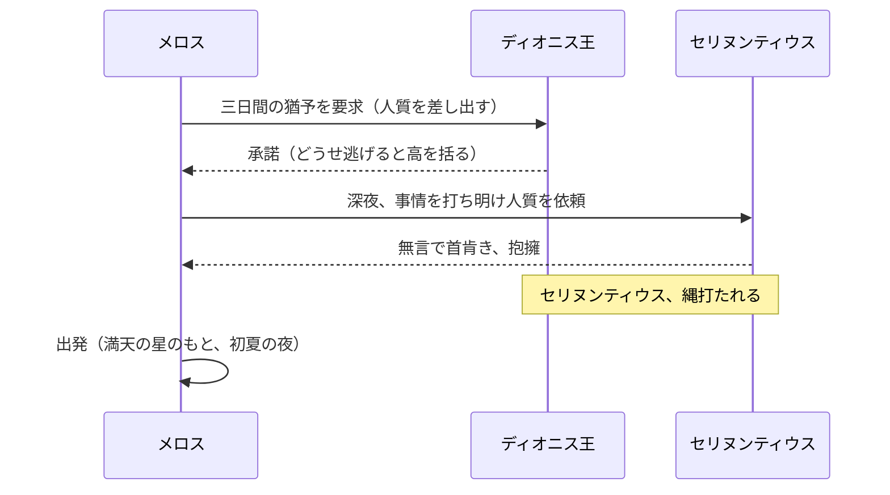

結論から言うね

👉それ、**めっちゃ正解**

詳しく解説するね！

# 走れメロス ― 信実の計算的記録

**メロスは激怒した。** $\text{正義} \ge \text{恐怖}$ という不等式が彼の魂を支配した瞬間、シラクスの命運は変わろうとしていた。

この文書は、太宰治の名作『走れメロス』[^1] を題材に、物語の構造と登場人物の行動原理を現代的な視点で紐解くものである。`inline code` の例を交えながら、 _信実という普遍の力_ を解析する。信実の価値は ~~証明不可能~~ 決して証明不可能ではなく、むしろ物語全体を通じて実証されてゆく。

## 登場人物

|       名前       | 役割                   | 特性                       |
| :--------------: | :--------------------- | :------------------------- |
|      メロス      | _牧人・主人公_         | 正直, 情熱的, **行動の人** |
| セリヌンティウス | 石工・メロスの親友     | 誠実, 沈黙, 信頼の象徴     |
|    ディオニス    | シラクスの暴君         | 孤独, 疑心, ~~慈悲~~ 暴虐  |
|        妹        | メロスの妹             | 純粋, 内気                 |
| フィロストラトス | セリヌンティウスの弟子 | 忠実, 悲観的               |

## 第一章：激怒と決意

**メロスは激怒した。** 必ず、かの邪智暴虐の王を除かなければならぬと決意した。メロスには政治がわからぬ。メロスは、 _村の牧人_ である。笛を吹き、羊と遊んで暮らしてきた。けれども邪悪に対しては、人一倍に敏感であった。

きょう未明メロスは村を出発し、野を越え山越え、**十里**はなれたシラクスの市にやって来た。妹の結婚式の支度を買いに来たはずが、まちの異変に気づく。老爺からの証言は恐ろしいものであった。

> 「王様は、人を殺します。悪心を抱いている、というのですが、誰もそんな悪心を持っては居りませぬ。」

「呆れた王だ。生かして置けぬ。」メロスはすぐさま、買い物を背負ったまま王城へ入って行った。たちまち捕縛され、王の前に引き出された。

### ディオニスの統治設定

暴君ディオニスの統治哲学は、次の設定ファイルに象徴される。

```json
{
  "city": "Syracuse",
  "ruler": "Dionysius",
  "policy": "execute_on_suspicion",
  "trust_level": 0,
  "executions_today": 6,
  "features": ["fear", "isolation", "absolute_power"]
}
```

`trust_level: 0` という絶望的な値がすべてを物語っている。

## 第二章：人質の取り決め ― 信実のプロトコル

### 王との交渉

メロスは処刑に際して、一つの条件を申し出た。

> 「ただ、私に情をかけたいつもりなら、処刑までに三日間の日限を与えて下さい。妹に亭主を持たせてやりたいのです。三日のうちに、必ず、ここへ帰って来ます。」

王はひそかに高を括った。どうせ帰って来ないと。しかしメロスは続けた。

> 「この市にセリヌンティウスという石工がいます。私の無二の友人だ。あれを人質としてここに置いて行こう。私が逃げてしまったら、あの友人を絞め殺して下さい。」

### 三者間のシーケンス

この取り決めの流れを整理すると、以下のシーケンス図のようになる。



竹馬の友セリヌンティウスは**無言で首肯き**、メロスをひしと抱きしめた。友と友の間は、それでよかった。

## 第三章：帰路の試練 ― 距離と時刻の計算

### 行程の概要

メロスが王との約束を果たすための行程を整理する。

|     区間      |      距離      | 主な障害                   | 難易度 |
| :-----------: | :------------: | :------------------------- | :----: |
| シラクス → 村 | 十里（≈40 km） | 夜間強行軍                 |  ★★☆   |
|  村での滞在   |       —        | 結婚式の準備、睡眠         |   —    |
| 村 → シラクス | 十里（≈40 km） | 豪雨・川の氾濫・山賊・疲労 |  ★★★   |

### 移動時間の推定

日没までに帰還できるかどうかは、次の不等式に依存する。

$$
t_{\text{残り}} = T_{\text{日没}} - T_{\text{現在}} \ge \frac{d_{\text{残り}}}{v_{\text{走行速度}}}
$$

村を出発した朝、メロスには十分な時間があった。しかし豪雨による川の氾濫と山賊が彼を足止めし、残り時間は刻一刻と消えていった。

$$
\begin{aligned}
d_{\text{総距離}} &= 40\,\text{km} \\
v_{\text{通常}} &\approx 8\,\text{km/h} \\
t_{\text{必要}} &= \frac{d_{\text{総距離}}}{v_{\text{通常}}} = \frac{40}{8} = 5\,\text{時間}
\end{aligned}
$$

### 信実の行列表現

三人の登場人物の間の信頼関係を行列で表すと、物語の核心が見えてくる。メロスを $i=0$、セリヌンティウスを $i=1$、ディオニスを $i=2$ とする信頼行列 $\mathbf{T}$ は次のようになる。

$$
\mathbf{T}=
\begin{bmatrix}
0 & 1 & 0\\
1 & 0 & 0\\
0 & 0 & 0
\end{bmatrix},
\quad
\det(\mathbf{T})= 0
$$

$\mathbf{T}_{01} = \mathbf{T}_{10} = 1$ はメロスとセリヌンティウスの相互信頼を示す。$\det(\mathbf{T}) = 0$ ――すべての信実がゼロでない限り、この行列は退化しない。

別の表示：$ a^2 + b^2 = c^2 $ であるように、二人の友情が組み合わさるとき、それは $ \alpha + \beta \ge \gamma $ という形で、孤独な王の疑念（$\gamma$）を超えるのだ。

## 第四章：試練の記録

帰路においてメロスが直面した障害を、プログラムで記録するとすれば以下のようになる。

### Bash：障害ログの解析

```bash
#!/usr/bin/env bash
set -euo pipefail

log_file="${1:-journey.log}"
echo "=== メロスの帰路ログを解析 ==="

# 障害一覧を抽出して深刻度順に表示
grep "OBSTACLE" "${log_file}" | while IFS='|' read -r ts event severity; do
  echo "[${ts}] ${event} (深刻度: ${severity})"
done

# ヒアドキュメントで概要を出力
cat <<'SUMMARY'
--- 帰路の主要障害 ---
1. 川の氾濫（橋崩壊）
2. 山賊の待ち伏せ
3. 灼熱と極度の疲労
SUMMARY
```

### Python：信実スコアの計算

```python
from __future__ import annotations
from dataclasses import dataclass

@dataclass(frozen=True, slots=True)
class Runner:
    name: str
    trust_score: float   # 0.0 〜 1.0
    distance_remaining: float  # km

def can_make_it(runner: Runner, time_left: float, speed: float) -> bool:
    """日没までに間に合うかどうかを判定する"""
    required = runner.distance_remaining / (speed * (1.0 + runner.trust_score))
    return required <= time_left

melos = Runner(name="メロス", trust_score=1.0, distance_remaining=5.0)
print([can_make_it(melos, t, 8.0) for t in [0.3, 0.4, 0.5]])
# [False, True, True]
```

### JavaScript / TypeScript：友情の型定義

```ts
type Bond = {
  from: string;
  to: string;
  trustLevel: number;
  isHostage: boolean;
};

const add = (a: Bond, b: Bond): number => a.trustLevel + b.trustLevel;
const clamp = (v: number, lo = 0, hi = 1) => Math.min(hi, Math.max(lo, v));

const melos_to_sel: Bond = {
  from: "メロス",
  to: "セリヌンティウス",
  trustLevel: 1.0,
  isHostage: true,
};
const sel_to_melos: Bond = {
  from: "セリヌンティウス",
  to: "メロス",
  trustLevel: 1.0,
  isHostage: false,
};

console.log(add(melos_to_sel, sel_to_melos), clamp(1.0));
// 2  1
```

### Rust：最終疾走のシミュレーション

```rust
fn sprint(distance: f64, trust: f64) -> f64 {
    let base_speed: f64 = 8.0; // km/h
    let speed = base_speed * (1.0 + trust);
    distance / speed
}

fn main() {
    let xs = vec![5.0, 4.0, 3.0, 2.0, 1.0]; // 残り距離の変化
    let times: Vec<f64> = xs.iter().map(|&d| sprint(d, 1.0)).collect();
    println!("所要時間リスト: {:?}", times);
}
```

### SQL：処刑記録の照会

王城の記録には、過去の処刑が残されていた。セリヌンティウスの名前がここに刻まれる寸前であった。

```sql
WITH ranked AS (
  SELECT prisoner_name, execution_date, charge,
         DENSE_RANK() OVER (ORDER BY execution_date DESC) AS rk
  FROM royal_records
  WHERE city = 'Syracuse'
)
SELECT * FROM ranked WHERE rk <= 10;
-- セリヌンティウスの処刑記録がもう少しで追加されるところだった
```

## 第五章：倒れるメロス ― 精神の臨界

疲れ果てたメロスは、路傍にがくりと膝を折った。以下がそれまでの障害の記録である。

- 濁流に飛び込み、百匹の大蛇のような浪と格闘した：期待値 $\mathbb{E}[\text{生存}] \ll 1$ という極限状況
- 山賊三人を棍棒で殴り倒した：KL ダイバージェンス $D_{\mathrm{KL}}(\text{正義}\|\text{暴力})$ が最大化された瞬間
- 灼熱の太陽のもとを孤独に走り続けた：体力 $\to 0$、ソフトマックス $\mathrm{softmax}(z_i)=\dfrac{e^{z_i}}{\sum_j e^{z_j}}$ が「絶望」に収束しかけた
- ~~信実~~：一時は悪魔の囁きに負けた

```text
[メロスの内的独白 ― 精神状態ログ]
T+00:00  出発。勇猛、希望に満ちる。
T+03:20  川、氾濫。橋消滅。しかし泳いで突破。
T+04:10  山賊、待ち伏せ。棍棒を奪い、三人を撃退。
T+05:30  灼熱、眩暈。膝折れる。「どうでもいい」という自暴自棄。
T+05:45  岩の裂け目から清水の音。希望の萌芽。$f(x) = x^2$ と書いてもここではただの記録。
T+05:46  「走れ！ メロス。」
```

悪魔の囁きに一時は屈したが、足もとに聞こえた**潺々たる泉の音**が彼を現実に引き戻した。

> 「義務遂行の希望である。わが身を殺して、名誉を守る希望である。斜陽は赤い光を、樹々の葉に投じ、葉も枝も燃えるばかりに輝いている。」

## 第六章：最終疾走と到達

泉の水を飲んだメロスは、再び立ち上がった。総和記号で表せば $\sum_{k=1}^{n} \text{苦難}_k = \frac{n(n+1)}{2}$ に達していたにもかかわらず、彼は走った。

$$
\int_{\text{泉}}^{\text{刑場}} \text{意志}(t)\,dt = \frac{\sqrt{\pi}}{2} \cdot \text{（信実の定数）}
$$

メロスは**黒い風のように**走った。路行く人を押しのけ、跳ねとばし、少しずつ沈んでゆく太陽の十倍も早く走った。フィロストラトスの声が追いかけてくる。

> 「もう、駄目でございます。走るのはやめて下さい。」
>
> 「いや、まだ陽は沈まぬ。」

_「それだから、走るのだ。信じられているから走るのだ。間に合う、間に合わぬは問題でないのだ。」_

陽が地平線に没しようとした最後の瞬間、メロスは疾風の如く刑場に突入した。**間に合った。**

## 結末：信実は空虚な妄想ではなかった

セリヌンティウスの縄はほどかれた。二人は互いの頬を力いっぱい殴り合い、そうして嬉し泣きにおいおいと声を放って泣いた。

暴君ディオニスは群衆の背後からその様子をまじまじと見つめ、やがて静かに二人に近づき、顔をあからめてこう言った。

> 「おまえらの望みは叶ったぞ。おまえらは、わしの心に勝ったのだ。**信実とは、決して空虚な妄想ではなかった。** どうか、わしをも仲間に入れてくれまいか。」

この物語が示す信実の公式を、最後に記しておく。

$$
\begin{aligned}
\text{信実}(\text{メロス}, \text{セリヌンティウス})
&= \sum_{i=1}^{N} \frac{\partial \ell(\text{約束}_i, \text{行動}_i)}{\partial \theta} \\
&= \mathbb{E}_{t \sim \text{試練}}\left[\text{友への愛と誠}\right]
\end{aligned}
$$

「すべての信実は疑われうるが、本物もある[^note2]。」 ―― これが物語の教えである。

フットノートの示すとおり[^1]、この物語は古代ギリシャに端を発しながら、時代を超えて「人を信じること」の価値を問い続けている。$x \in \mathbb{R}$ の世界では $\nabla f(x)$ によって最適解へ収束するが、信実の世界においてはメロスの走りそのものが証明となる。

[^1]: 太宰治『走れメロス』（1940年）。古代ギリシャの故事「ダモンとピュティアス」を原典とする。シラクスの僭主ディオニュシオスを題材とした物語の近代的再構成。フットノートでも数式は有効：$a \cdot b = b \cdot a$。

[^note2]: 「信実とは、決して空虚な妄想ではなかった。」― ディオニス王の言葉。物語のクライマックスで、暴君自身が信実の存在を認めた場面。リンクも [OK](https://example.org)。
